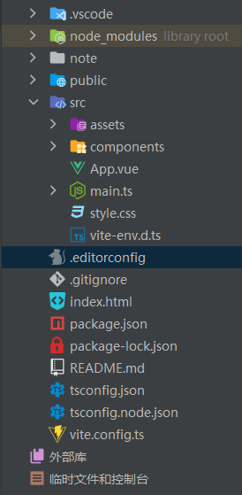
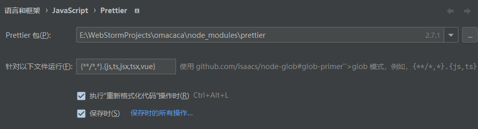

# 项目构建流程

<!-- 这里记载了这个项目从头到尾的构建流程 -->
唐瑞祥 2022年8月29日

## 软件准备

### 前端

1. **Node.js** [Windows下载安装稳定版就行](https://nodejs.org/en/)
   - 配置下npm [网上随便找个教程](https://blog.csdn.net/ZHANGYANG_1109/article/details/121229581)
     - 经典要换个源才好用
       ``` npm config set registry=https://registry.npm.taobao.org ```
     - 但是换了源的时候，用npm search 包的时候会报错，加个参数
       ```npm search vite --registry=https://registry.npmjs.org```

2. **WebStorm** [前端IDE Windows下载](https://www.jetbrains.com/webstorm/)
   - 收费但是可以破解，可以申请学生账户
     - 需要装一些[插件](https://juejin.cn/post/7067703148734840869)
         - Chinese Language Pack / 中文语言包
         - Key Promoter X 快捷键使用说明
         - Atom Material Icons 换图标，别问，问就是可爱
         - Rainbow Brackets 彩虹括号，别问，问就是可爱
         - Translation 起名字神器
         - CodeGlance Pro 代码小地图
         - GitToolBox：Git功能扩展
         - I18n-ally 代码内可以实时看到对应的语言内容

3. **浏览器 Edge** Chrome也行，IE狗都不用
   - 可以安装一个 [Vue Devtools](https://chrome.google.com/webstore/detail/vuejs-devtools/nhdogjmejiglipccpnnnanhbledajbpd/related) 插件
### 后端

### 其他

## 项目配置

1. vite + vue3 创建项目
   > [vite](https://cn.vitejs.dev/guide/)
   > 是一种新型前端构建工具，能够显著提升前端开发体验。它主要由两部分组成：
   > - 一个开发服务器，它基于 原生 ES 模块 提供了 丰富的内建功能，如速度快到惊人的 模块热更新（HMR）。
   > - 一套构建指令，它使用 Rollup 打包你的代码，并且它是预配置的，可输出用于生产环境的高度优化过的静态资源。

   是能用最新版本的软件就用最新的（但也不强行追求最新毕竟有些还是实验性的，开发时用最新的稳点版就行）
   之前用的2.7.6 这次从头写就用最新的3.0.9好了。

   vite2 -> vite3有一定的改动，要尽可能适应新的改动才能跟上时代，毕竟写这项目不像做商业项目需求稳定。

   此外之前用的js开发的，但是感觉大家都用ts了，这次也用ts吧，学习一下

   vite 配置的项目可以自选 ts 或 js 加载到项目依赖里

   也可以自行全局安装使用：```npm i typescript -g```

   先用vite建个项目 ```omacaca``` 在 WebStorm 中打开终端

   这里终端没有管理员权限可能会报错，解决方案是 给webstorm加一个管理员权限-_-

   ```
   $ npm create vite@latest

   Need to install the following packages:
     create-vite@3.0.2
   Ok to proceed? (y) y
   √ Project name: ... omacaca
   √ Select a framework: » vue
   √ Select a variant: » vue-ts

   Scaffolding project in E:\WebStormProjects\omacaca...
   Done. Now run:

     cd omacaca
     npm install
     npm run dev

   $ npm install
   $ npm run dev

   ```

   目录结构如下

   
2. typescript 的编译配置
   
   ts 的编译配置写在 ```tsconfig.json ``` 中，这里是使用 ```vite``` 构建好项目后自动生成的，
   不需要再额外配置，如果后面有需要可以在此改动

   ```json
   {
   	"compilerOptions": {
   		"target": "ESNext",
   		"useDefineForClassFields": true,
   		"module": "ESNext",
   		"moduleResolution": "Node",
   		"strict": true,
   		"jsx": "preserve",
   		"sourceMap": true,
   		"resolveJsonModule": true,
   		"isolatedModules": true,
   		"esModuleInterop": true,
   		"lib": [
   			"ESNext",
   			"DOM"
   		],
   		"skipLibCheck": true,
   		"removeComments": true // 删除编译后的所有的注释
   	},
   	"include": [
   		"src/**/*.ts",
   		"src/**/*.d.ts",
   		"src/**/*.tsx",
   		"src/**/*.vue"
   	],
   	"references": [
   		{
   			"path": "./tsconfig.node.json"
   		}
   	]
   }
   
   ```

3. 代码规范

   使用 [EditorConfig](https://editorconfig.org/) + [Prettier](https://www.prettier.cn/) + [Eslint](https://eslint.org/)
   统一~~团队~~代码风格

   这三个工具都有类似的目标：

   保持代码本身以及团队成员之间代码的一致性。

   检测可能导致潜在 bugs 的有问题的代码模式。

   > - ESLint 是目前最受欢迎的 JavaScript 代码检测工具。它会静态分析你的代码，以帮助您检测格式问题并查找代码不一致的地方。(
   > 解决代码质量问题)
   > - Prettier 的 **格式化** 代码功能与 ESLint 很像，但它不检查你的代码质量。它只是作为一个代码格式化工具，
   > 原生支持 JavaScript ，同时它也支持 JSX、Flow、TypeScript、HTML、JSON、CSS 等其他众多语言。(解决代码风格问题)
   >
   > - EditorConfig 则既不检测也不格式化你的代码。它仅仅在开发者团队内部使用的所有 IDE 和编辑器之间
   > 定义了一份标准的代码风格指南。比如，一个团队主要使用 Sublime Text 和 VSCode，EditorConfig 能够使得它们在单个文件内定义公共的缩进模式（空格或制表符）。
   >
   > - 代码质量规则 (code-quality rules)
   >   * no-unused-vars
   >   * no-extra-bind
   >   * no-implicit-globals
   >   * prefer-promise-reject-errors
   >
   > - 代码风格规则 (code-formatting rules)
   >   * max-len
   >   * no-mixed-spaces-and-tabs
   >   * keyword-spacing
   >   * comma-style

   1. 新版的 Webstorm 已经集成了 EditorConfig [官方说明](https://www.jetbrains.com/help/webstorm/2022.2/configuring-code-style.html)

   新建 ```.editorconfig``` 的时候可以自动生成一些语言的默认配置，包括基础 EditorConfig 的和 Webstorm 提供的
   使用默认版，按自己的喜好风格制定就行了
   ```
   root = true
   
   [*]  
   charset = utf-8  
   end_of_line = lf  
   indent_size = 4  
   indent_style = tab  
   insert_final_newline = true  
   trim_trailing_whitespace = true  
   max_line_length = 120  
   tab_width = 4  
   
   [*.md]  
   indent_style = space  
   insert_final_newline = false  
   trim_trailing_whitespace = false # 两个空格可以换行
   ```

   2. 新版的 Webstorm 已经集成了 Prettier 插件 [官方说明](https://www.jetbrains.com/help/webstorm/prettier.html)

   需要在项目中（```Alt+F12```打开终端）安装  ```Prettier``` 
   ```
    npm install --save-dev --save-exact prettier
    echo {}> .prettierrc.json
   ```

   ```.prettierrc.json``` 中具体规范设置为 [参考](https://www.jianshu.com/p/18999f6e1668)：
   ```json
    {
        "printWidth": 120,
        "useTabs": true,
        "tabWidth": 4,
        "semi": false,
        "singleQuote": true,
        "trailingComma": "es5"
    }
    ``` 
   
   然后在插件设置中：  
   - 添加对 ```.vue```文件的支持
   - [x] 执行"重新格式化代码"操作时 Ctrl+Alt+L
   - [x] 保存时

   

   使用命令行格式化
   > （1）格式化全部文档  
   > ```npx prettier --write .```  
   > （2）格式化指定文档  
   > ```npx prettier --write src/components/Button.js```  
   > （3）检查文档是否已格式化  
   > ```npx prettier --check .``` //检查指定文件同上

   3. 新版的 Webstorm 已经集成了 Eslint [官方说明](https://www.jetbrains.com/help/webstorm/eslint.html)

   需要在项目中（```Alt+F12```打开终端）安装  ```Eslint```

   过程中坑奇多 我参考了[这篇文章](https://blog.csdn.net/mChales_Liu/article/details/124324862?app_version=5.7.3&csdn_share_tail=%7B%22type%22%3A%22blog%22%2C%22rType%22%3A%22article%22%2C%22rId%22%3A%22124324862%22%2C%22source%22%3A%22qq_32580813%22%7D&utm_source=app)，
   主要依靠里面每个包的使用介绍，安装过程不重要了可以用 ```npx eslint --init``` 跑一次过程中会帮助你安装好一些包

   反正最后 ```package.json``` 文件中 ```devDependencies``` 需要拥有以下依赖：

   ```json
    {
        "@typescript-eslint/eslint-plugin": "^5.36.1",
        "@typescript-eslint/parser": "^5.36.1",
        "@vitejs/plugin-vue": "^3.0.3",
        "eslint": "^8.22.0",
        "eslint-config-prettier": "^8.5.0",
        "eslint-config-standard-with-typescript": "^22.0.0",
        "eslint-plugin-import": "^2.26.0",
        "eslint-plugin-n": "^15.2.5",
        "eslint-plugin-prettier": "^4.2.1",
        "eslint-plugin-promise": "^6.0.1",
        "eslint-plugin-vue": "^9.4.0",
        "prettier": "2.7.1",
        "typescript": "^4.8.2",
        "vite": "^3.0.7",
        "vite-plugin-eslint": "^1.8.1",
        "vue-eslint-parser": "^9.0.3",
        "vue-tsc": "^0.39.5"
    }
   ```
   缺那些用 ```npm i -D packagename``` 自行安装

   vite的 配置文件 ```vite.config.ts``` 中添加一个插件配置

   ```
    plugins: [
        vue(),
        // 使eslint报错的信息 随vite输出到浏览器
        eslintPlugin({
            include: ['src/**/*.ts', 'src/**/*.js', 'src/**/*.vue', 'src/*.js', 'src/*.vue'],
            cache: false, // 禁用 eslint 缓存
        }),
    ]
   ```
   
   然后最重要的 ```.eslintrc.cjs``` 中需要如下配置：

   ```js
   // .eslintrc.js 文件
   module.exports = {
       root:true,
       env: {
           browser: true,
           es2021: true,
           node: true
       },
       extends: [
           'standard',
           'plugin:vue/vue3-recommended',
           'plugin:prettier/recommended'
       ],
       // 新的内容
       parser: 'vue-eslint-parser',
       parserOptions: {
           ecmaVersion: 'latest',
           sourceType: 'module',
           ecmaFeatures: {
               modules: true
           },
           requireConfigFile: false,
           parser: '@typescript-eslint/parser'
       },
       plugins: [
           'vue',
           'eslint-plugin-prettier'
       ],
       rules: {
           'prettier/prettier': 'error',
           'no-console': process.env.NODE_ENV === 'production' ? 'warn' : 'off',
           'no-debugger': process.env.NODE_ENV === 'production' ? 'warn' : 'off',
           'vue/no-multiple-template-root': 'off',
           'vue/multi-word-component-names': 'off',
           'no-mutating-props': 'off',
           'vue/no-v-html': 'off'
       }
   }
   ```
   
   这里给一些规则配置的[参考](https://cloud.tencent.com/developer/section/1135570) 以及[官网](https://eslint.org/docs/latest/user-guide/getting-started)
   
   最后在 Webstorm 的设置中找到Eslint的插件设置设置为自动即可

4. 配置 Git 与 GitHub 
   
   Git 的软件需要自己下载配置安装，命令行使用，webstorm也集成了相关功能
   
   要远程连接github仓库，初次使用时除了在登录你的邮箱账号外，还需要配置下 ssh key 确保不会被github拒绝

   可以在git bash 中输入 ```ssh-keygen```
   
   将生成的 ```id_rsa.pub``` 上传到github的设置 ssh key 中
   
   记得生成的时候加一个密码，第一上传时 Webstorm 会要求你填写密码

---
## 到这里项目的前期配置就基本完成了，可以着手开始开发了